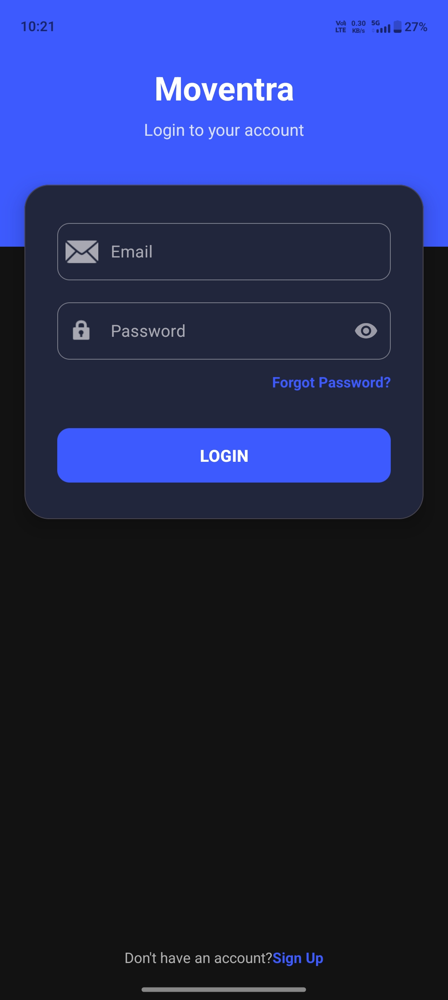
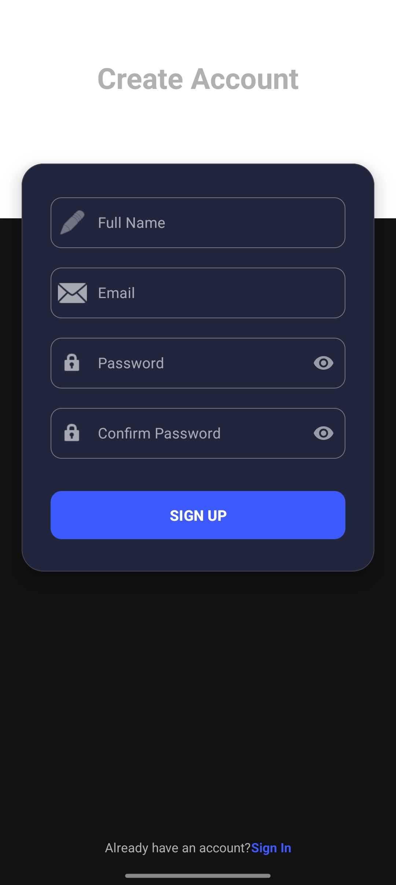
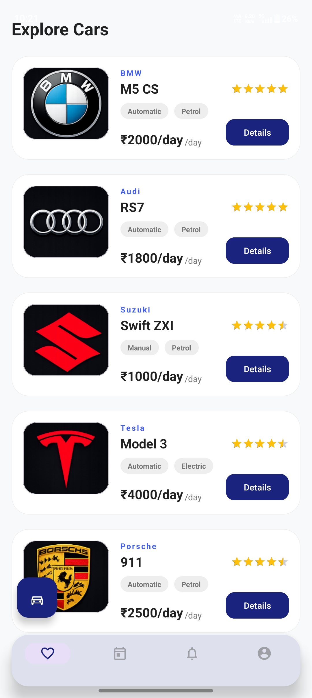
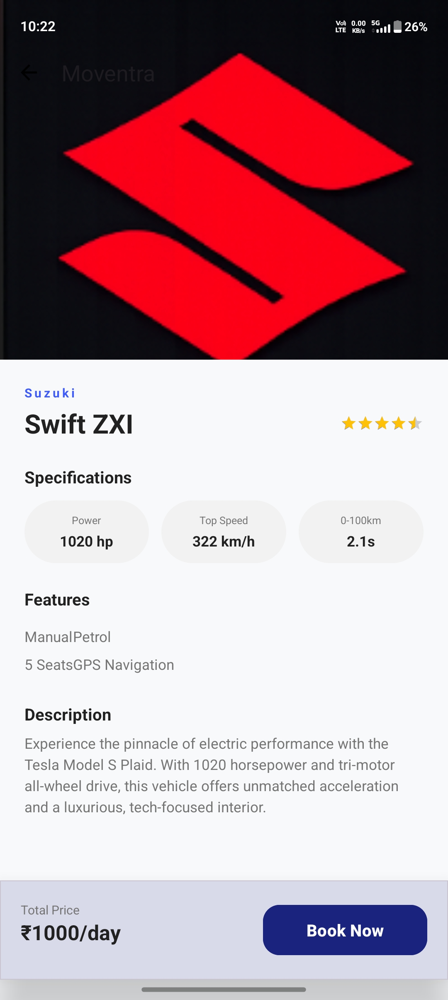
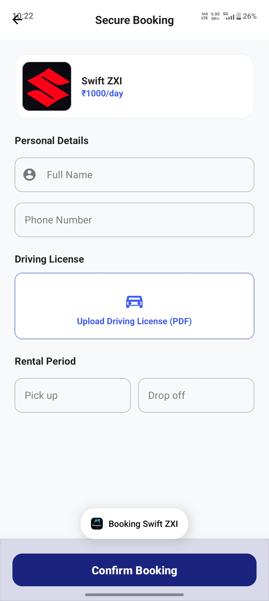
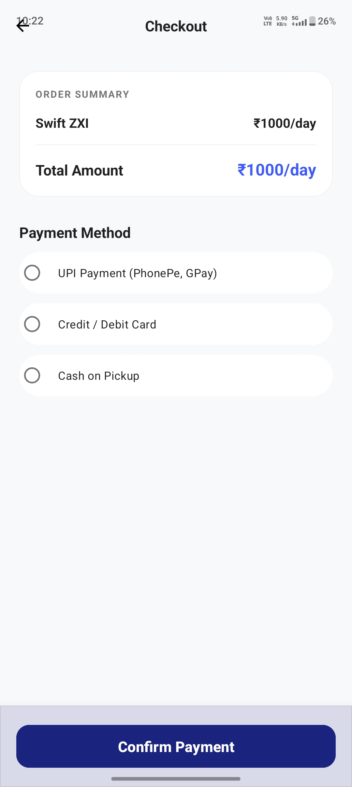
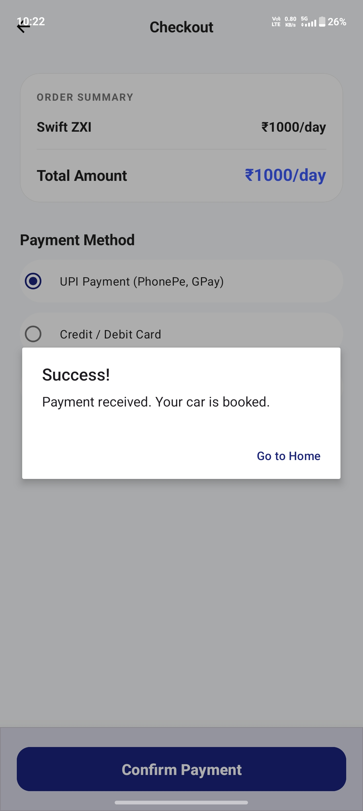
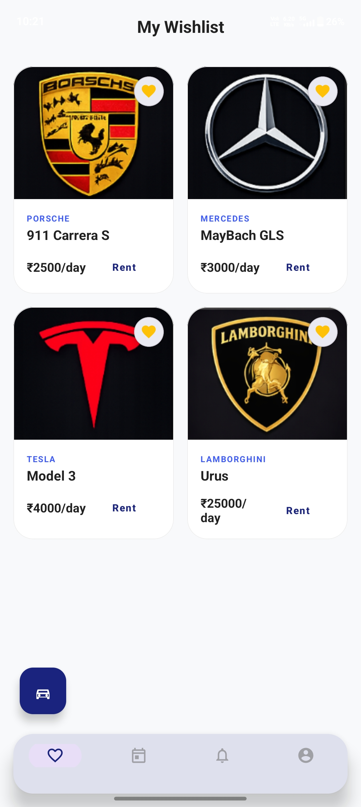
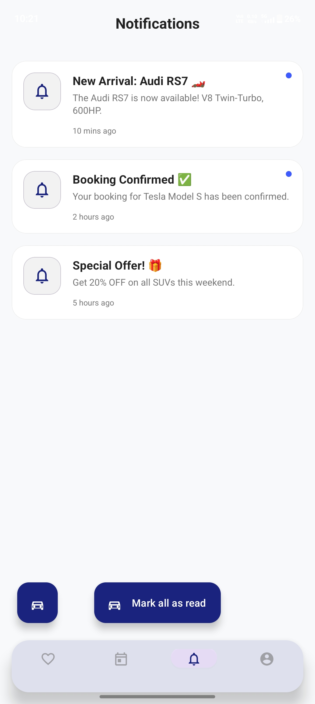
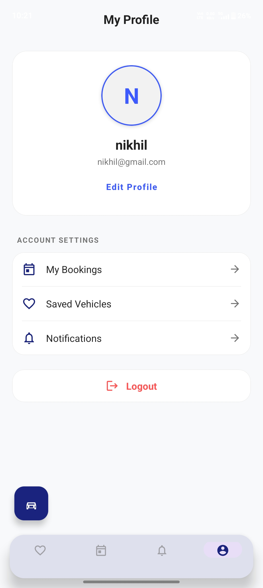

#  Moventra

Moventra is an Android-based vehicle rental application developed using Java and Android Studio.  
The application provides users with a smooth and user-friendly experience for browsing vehicles, viewing details, managing bookings, maintaining wishlists, and handling user authentication.

---

#  Features

- Splash Screen with fade animation
- User Login & Signup
- Vehicle Browsing System
- Detailed Vehicle Information
- Vehicle Booking Feature
- Wishlist Management
- Notifications Screen
- User Profile Management
- Smooth Navigation UI
- Session Management using SharedPreferences

---

#  Technologies Used

- Java
- Android Studio
- XML
- SharedPreferences
- Material Design Components

---

#  Screenshots

## Splash Screen


## Login Screen


## Signup Screen


## Home Screen


## Detailed Vehicle Page


## Booking Screen


## Checkout Screen


## Payment Screen


## Wishlist Screen


## Notifications Screen


## Profile Screen


---

#  Installation Steps

1. Clone the repository

```bash
git clone https://github.com/VortexViper1/Moventra.git
